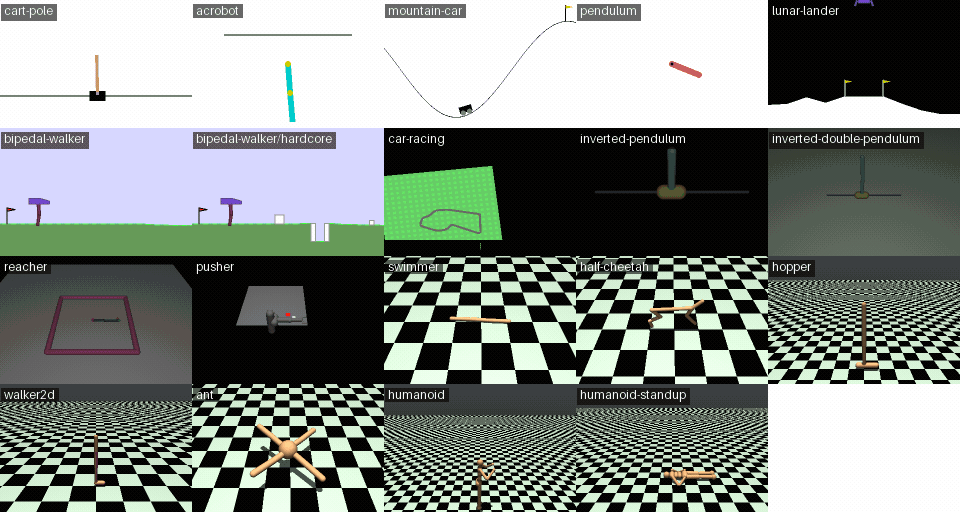

# jax-gym

Gymnasium's classic control, Box2D and MuJoCo tasks in pure JAX, registered as
`jax_pomdps` POMDPs. The package publishes only registry names.

Everything here is a copy. The tasks, their dynamics, rewards and scenes, and the robot
models were invented and built by the people listed under [Credits](#credits); this
repository only re-expresses their work in JAX.



[Documentation](https://mishmish66.github.io/jax-gym/) describes every task, quoting its
sources, with 16 rollouts of a trained policy for each.

```python
import jax, jax_pomdps

# or `import jax_gym`, then make("lunar-lander")
env = jax_pomdps.make("jax_gym:lunar-lander")
keys = jax.random.split(jax.random.key(0), 4096)
state = jax.vmap(env.reset)(keys)
action = jax.vmap(env.action_space.sample)(keys)
next_state = jax.vmap(env.step)(keys, state, action)
reward = jax.vmap(env.reward)(keys, state, action, next_state)
obs = jax.vmap(env.observe)(keys, next_state, action)
done = jax.vmap(env.done)(next_state)
```

Tasks do not truncate on their own, so truncate them to match gym.

## Credits

The tasks and their inventors:

- **CartPole**: Andrew G. Barto, Richard S. Sutton and Charles W. Anderson, "Neuronlike
  adaptive elements that can solve difficult learning control problems", *IEEE
  Transactions on Systems, Man, and Cybernetics* SMC-13(5), 1983; code after Sutton's
  `pole.c`.
- **Acrobot**: Richard S. Sutton, "Generalization in reinforcement learning: Successful
  examples using sparse coarse coding", NIPS 1996; Richard S. Sutton and Andrew G. Barto,
  *Reinforcement Learning: An Introduction*, MIT Press (1998; 2nd ed. 2018).
  Implementation from RLPy by Alborz Geramifard, Robert H. Klein, Christoph Dann, William
  Dabney and Jonathan P. How.
- **MountainCar** and **MountainCarContinuous**: Andrew W. Moore, *Efficient
  Memory-based Learning for Robot Control*, PhD thesis, University of Cambridge, 1990.
- **Pendulum**: the classic inverted-pendulum swing-up; Gymnasium's implementation by
  Carlos Luis.
- **LunarLander**, **BipedalWalker** and **CarRacing**: created by Oleg Klimov for OpenAI
  Gym, with Gymnasium's versions by Andrea Pierré. CarRacing's car follows Chris
  Campbell's top-down car tutorial (iforce2d, 2014). They simulate with Box2D, by Erin
  Catto, whose methods `jax_gym.rigid2d` reimplements: "Iterative Dynamics with Temporal
  Coherence" (GDC 2005) and "Fast and Simple Physics using Sequential Impulses" (GDC
  2006).
- **InvertedPendulum** and **InvertedDoublePendulum**: Barto, Sutton and Anderson (1983),
  as above.
- **HalfCheetah**: Paweł Wawrzyński, "A cat-like robot real-time learning to run",
  ICANNGA 2009.
- **Hopper** and **Walker2d**: Tom Erez, Yuval Tassa and Emanuel Todorov,
  "Infinite-horizon model predictive control for periodic tasks with contacts", RSS
  2011.
- **Humanoid** and **HumanoidStandup**: Yuval Tassa, Tom Erez and Emanuel Todorov,
  "Synthesis and stabilization of complex behaviors through online trajectory
  optimization", IROS 2012. The simplified models here follow Brax's: C. Daniel Freeman,
  Erik Frey, Anton Raichuk, Sertan Girgin, Igor Mordatch and Olivier Bachem, "Brax – A
  Differentiable Physics Engine for Large Scale Rigid Body Simulation", NeurIPS Datasets
  and Benchmarks 2021.
- **Swimmer**: Rémi Coulom, *Reinforcement Learning Using Neural Networks, with
  Applications to Motor Control*, PhD thesis, Institut National Polytechnique de
  Grenoble, 2002.
- **Ant**: John Schulman, Philipp Moritz, Sergey Levine, Michael I. Jordan and Pieter
  Abbeel, "High-dimensional continuous control using generalized advantage estimation",
  ICLR 2016.
- **Reacher** and **Pusher**: OpenAI Gym's MuJoCo suite.
- The **v5 MuJoCo tasks** these ports follow: Kallinteris-Andreas, with Rushiv Arora for
  HalfCheetah and Swimmer.
- **Tiger**: Leslie Pack Kaelbling, Michael L. Littman and Anthony R. Cassandra,
  "Planning and acting in partially observable stochastic domains", *Artificial
  Intelligence* 101, 1998.

The software these ports copy and run on:

- **OpenAI Gym**: Greg Brockman, Vicki Cheung, Ludwig Pettersson, Jonas Schneider, John
  Schulman, Jie Tang and Wojciech Zaremba, "OpenAI Gym", arXiv:1606.01540, 2016.
- **Gymnasium**, whose implementations, models and scenes are ported here: Mark Towers,
  Ariel Kwiatkowski, Jordan K. Terry, John U. Balis, Gianluca De Cola, Tristan Deleu,
  Manuel Goulão, Andreas Kallinteris, Markus Krimmel, Arjun KG, Rodrigo Perez-Vicente,
  Andrea Pierré, Sander Schulhoff, Jun Jet Tai, Hannah Tan and Omar G. Younis,
  "Gymnasium: A Standard Interface for Reinforcement Learning Environments",
  arXiv:2407.17032, 2024; and the Farama Foundation.
- **MuJoCo**: Emanuel Todorov, Tom Erez and Yuval Tassa, "MuJoCo: A physics engine for
  model-based control", IROS 2012; maintained by Google DeepMind, with **MJX**, on which
  the MuJoCo tasks run.
- **MuJoCo Playground**, whose tasks `jax_gym.playground` registers: Kevin Zakka, Baruch
  Tabanpour, Qiayuan Liao, Mustafa Haiderbhai, Samuel Holt, Jing Yuan Luo, Arthur
  Allshire, Erik Frey, Koushil Sreenath, Lueder A. Kahrs, Carlo Sferrazza, Yuval Tassa and
  Pieter Abbeel, "MuJoCo Playground: An open-source framework for GPU-accelerated robot
  learning and sim-to-real transfer", 2025. Its tasks build on the DeepMind Control Suite
  (Yuval Tassa et al., 2018) and the robot models of MuJoCo Menagerie (Kevin Zakka et al.,
  2022), each with its own authors and license.
- **JAX**: James Bradbury, Roy Frostig, Peter Hawkins, Matthew James Johnson, Chris
  Leary, Dougal Maclaurin, George Necula, Adam Paszke, Jake VanderPlas, Skye
  Wanderman-Milne and Qiao Zhang, "JAX: composable transformations of Python+NumPy
  programs", 2018.
- The capsule and cylinder ray intersections in the MuJoCo renderer follow **Inigo
  Quilez**'s intersectors.
- The transfer table trains with **PPO**: John Schulman, Filip Wolski, Prafulla
  Dhariwal, Alec Radford and Oleg Klimov, "Proximal Policy Optimization Algorithms",
  arXiv:1707.06347, 2017.

Licenses: the copied and ported parts keep their licenses (Gymnasium's MIT, RLPy's BSD
3-Clause, Brax's Apache 2.0), with full texts and a file-by-file account in
[THIRD_PARTY_NOTICES.md](THIRD_PARTY_NOTICES.md). Only the new material is under
[LICENSE](LICENSE).

## Tasks

| name | Gymnasium | limit | dynamics |
|---|---|---:|---|
| `cart-pole` | `CartPole-v1` | 500 | exact |
| `acrobot` | `Acrobot-v1` | 500 | exact |
| `mountain-car` | `MountainCar-v0` | 200 | exact |
| `mountain-car/continuous` | `MountainCarContinuous-v0` | 999 | exact |
| `pendulum` | `Pendulum-v1` | 200 | exact |
| `lunar-lander`, `lunar-lander/continuous` | `LunarLander-v3` | 1000 | `rigid2d` |
| `bipedal-walker`, `bipedal-walker/hardcore` | `BipedalWalker-v3` | 1600, 2000 | `rigid2d` |
| `car-racing`, `car-racing/discrete` | `CarRacing-v3` | 1000 | single rigid body |
| `inverted-pendulum` | `InvertedPendulum-v5` | 1000 | MJX |
| `inverted-double-pendulum` | `InvertedDoublePendulum-v5` | 1000 | MJX |
| `reacher` | `Reacher-v5` | 50 | MJX |
| `pusher` | `Pusher-v5` | 100 | MJX |
| `swimmer` | `Swimmer-v5` | 1000 | MJX |
| `half-cheetah` | `HalfCheetah-v5` | 1000 | MJX |
| `hopper` | `Hopper-v5` | 1000 | MJX |
| `walker2d` | `Walker2d-v5` | 1000 | MJX |
| `ant` | `Ant-v5` | 1000 | MJX |
| `humanoid` | `Humanoid-v5` | 1000 | MJX |
| `humanoid-standup` | `HumanoidStandup-v5` | 1000 | MJX |

`tiger` is the tiger problem of Kaelbling, Littman & Cassandra (1998).

Keyword arguments follow Gymnasium's: `jax_pomdps.make("lunar-lander", enable_wind=True)`,
`jax_pomdps.make("hopper", reset_noise_scale=0.01)`.

## MuJoCo Playground

With the `playground` extra, `import jax_gym.playground` registers Playground's 54 tasks
as `playground/<name>`, e.g. `playground/go1-joystick-flat-terrain`.

## Transfer

PPO agents trained on each side, evaluated on both. Each entry is the mean return of the
deterministic policy over 50 episodes under Gymnasium's time limit, averaged over 3 seeds,
± the standard deviation across seeds. Both sides use the same agent, hyperparameters and
step budget.

| task | trained here, on here | trained here, on Gymnasium | trained on Gymnasium, on here | trained on Gymnasium, on Gymnasium |
|---|---:|---:|---:|---:|
| `cart-pole` | 500 ± 0 | 500 ± 0 | 500 ± 0 | 500 ± 0 |
| `acrobot` | -83 ± 4 | -87 ± 3 | -86 ± 5 | -84 ± 1 |
| `mountain-car` | -127 ± 0 | -141 ± 1 | -128 ± 0 | -141 ± 0 |
| `mountain-car/continuous` | 94 ± 0 | 94 ± 0 | 94 ± 0 | 94 ± 0 |
| `pendulum` | -139 ± 1 | -142 ± 2 | -140 ± 1 | -148 ± 6 |
| `lunar-lander` | 280 ± 2 | 283 ± 1 | 284 ± 1 | 282 ± 1 |
| `lunar-lander/continuous` | 207 ± 31 | 238 ± 24 | 217 ± 14 | 252 ± 10 |
| `bipedal-walker` | 280 ± 1 | 261 ± 4 | 194 ± 121 | 167 ± 160 |
| `bipedal-walker/hardcore` | 7.4 ± 40.3 | -67 ± 11 | -84 ± 9 | 3.0 ± 5.9 |
| `car-racing` | 645 ± 105 | 560 ± 141 | 401 ± 24 | 464 ± 67 |
| `inverted-pendulum` | 1,000 ± 0 | 1,000 ± 0 | 1,000 ± 0 | 1,000 ± 0 |
| `inverted-double-pendulum` | 8,993 ± 254 | 9,176 ± 150 | 8,558 ± 437 | 8,925 ± 212 |
| `reacher` | -4.6 ± 0.3 | -4.6 ± 0.2 | -4.6 ± 0.4 | -4.7 ± 0.3 |
| `pusher` | -35 ± 3 | -36 ± 4 | -39 ± 1 | -40 ± 1 |
| `swimmer` | 11 ± 23 | 13 ± 23 | 33 ± 11 | 35 ± 9 |
| `half-cheetah` | 3,958 ± 1,518 | 3,932 ± 1,584 | 3,107 ± 1,714 | 3,094 ± 1,729 |
| `hopper` | 3,426 ± 165 | 3,425 ± 168 | 2,899 ± 698 | 2,968 ± 681 |
| `walker2d` | 4,149 ± 10 | 4,188 ± 73 | 4,461 ± 1,177 | 4,265 ± 1,252 |
| `ant` | 3,902 ± 608 | 4,021 ± 837 | 4,203 ± 445 | 4,297 ± 616 |
| `humanoid` | 5,929 ± 73 | 4,257 ± 674 | 5,554 ± 211 | 5,904 ± 312 |
| `humanoid-standup` | 181,702 ± 12,849 | 157,785 ± 3,016 | 176,728 ± 31,301 | 199,189 ± 19,411 |

## Variants

Names join words with dashes, and variants follow slashes: task variants first
(`lunar-lander/continuous`), then observation variants.

- `{name}/pix` observes renders of the next state, uint8 of shape (64, 64, 3) by default,
  for every task but `tiger`.
- `{name}/pix-prp` observes dicts: `"pixels"` holds the render, and `"prp"` holds
  proprioception. It exists for the robots and the car:
  - `bipedal-walker` and `bipedal-walker/hardcore`: joint angles and speeds and leg
    contacts, entries 4–13 of the state observation.
  - `reacher`, `pusher`, `swimmer`, `half-cheetah`, `hopper`, `walker2d`, `ant`,
    `humanoid` and `humanoid-standup`: positions, then velocities, of the actuated
    joints.
  - `car-racing` and `car-racing/discrete`: speed, wheel spins, front steering angle and
    yaw rate, scaled as Gymnasium's indicator bar scales them.
- `car-racing/prp` observes that proprioception alone, and `car-racing/vec` adds the
  velocity in the car's frame, which wheels are on the road, and 10 track points ahead in
  the car's frame. Gymnasium's CarRacing observes only its 96×96 view, which `car-racing`
  keeps.

```python
env = jax_pomdps.make("hopper/pix-prp", width=84, height=84, reset_noise_scale=0.01)
obs = env.observe(key, next_state, action)  # {"pixels": (84, 84, 3), "prp": (6,)}
```

`width` and `height` set the image size; the other arguments go to the task. The classic
control and Box2D tasks draw Gymnasium's scene. The MuJoCo tasks ray-cast their geoms, lit
and colored like MuJoCo's default scene, and their locomotion cameras follow the body;
Gymnasium's cameras stay fixed. Every task but `tiger` also has
`env.render(state, width, height)`.

## Speed

Steps per second, and compile times, of `jit(vmap(scan(...)))` over 4096 environments and
100 steps, on an idle RTX 5090 with a Ryzen 9 9950X3D. Pixels are the 64×64 `/pix`
variants; CarRacing's state is `car-racing/vec`, and its own 96×96 view runs at 593k
steps/s. Gymnasium 1.3 runs on the same machine's CPU with random actions: one env, an
`AsyncVectorEnv` of 32, and one env rendering an `rgb_array` frame each step (64×64 for
MuJoCo, the native size otherwise).

| task | state compile | state | pixels compile | pixels | Gymnasium, 1 env | Gymnasium, 32 envs | Gymnasium, rendering |
|---|---:|---:|---:|---:|---:|---:|---:|
| `cart-pole` | 0.3 s | 559M | 0.4 s | 4.0M | 280k | 167k | 1.4k |
| `acrobot` | 0.4 s | 289M | 0.6 s | 4.2M | 58k | 146k | 1k |
| `mountain-car` | 0.3 s | 563M | 0.5 s | 3.5M | 193k | 166k | 1.3k |
| `mountain-car/continuous` | 0.3 s | 563M | 0.4 s | 3.5M | 93k | 154k | 1.3k |
| `pendulum` | 0.3 s | 577M | 0.5 s | 5.7M | 67k | 116k | 754 |
| `lunar-lander` | 1.3 s | 2.5M | 2.0 s | 117k | 59k | 112k | 1.2k |
| `lunar-lander/continuous` | 1.4 s | 2.5M | 2.0 s | 117k | 35k | 99k | 1.2k |
| `bipedal-walker` | 1.5 s | 1.1M | 3.2 s | 39k | 13k | 68k | 652 |
| `bipedal-walker/hardcore` | 1.5 s | 1.1M | 3.1 s | 39k | 13k | 59k | 578 |
| `car-racing` | 1.1 s | 3.8M | 2.2 s | 1.1M | 424 | 1.4k | 186 |
| `inverted-pendulum` | 1.9 s | 445k | 5.8 s | 241k | 43k | 117k | 12k |
| `inverted-double-pendulum` | 2.6 s | 144k | 6.6 s | 103k | 23k | 88k | 9k |
| `reacher` | 3.1 s | 443k | 7.0 s | 165k | 36k | 89k | 10k |
| `pusher` | 7.5 s | 380k | 11.7 s | 31k | 28k | 79k | 5.2k |
| `swimmer` | 3.4 s | 211k | 7.5 s | 85k | 25k | 71k | 5.6k |
| `half-cheetah` | 3.8 s | 247k | 7.7 s | 55k | 33k | 79k | 5.4k |
| `hopper` | 4.9 s | 120k | 8.9 s | 58k | 16k | 68k | 4.7k |
| `walker2d` | 4.6 s | 82k | 8.7 s | 39k | 14k | 66k | 4.5k |
| `ant` | 5.7 s | 44k | 9.4 s | 23k | 7.8k | 43k | 3.1k |
| `humanoid` | 10.3 s | 239k | 11.6 s | 37k | 7.6k | 39k | 2.9k |
| `humanoid-standup` | 10.9 s | 140k | 11.8 s | 33k | 4.4k | 28k | 2.2k |

## Development

```
uv sync                 # CPU
uv sync --extra cuda    # GPU
uv run pytest
uv sync --extra playground   # MuJoCo Playground's tasks and their tests
```

The documentation site is pdoc's rendering of the package, whose page includes
`docs/tasks.md`. `docs/build.py` writes it; its GIFs are in Git LFS, which clones skip:

```
uv run --extra playground --with pdoc python docs/build.py --out site
```
